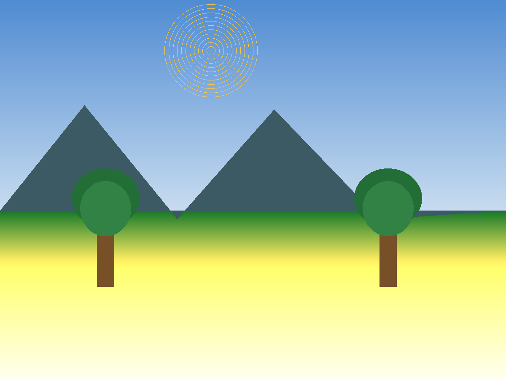
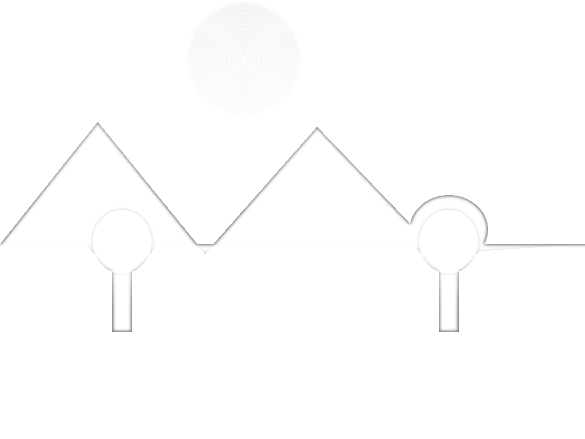

# Photo to Pencil Sketch — Python + OpenCV

Convert any colour photo into a realistic pencil sketch with a simple Tkinter GUI. Beginner-friendly project for learning image processing and GUI basics.


## Demo




GUI flow: Choose Image → adjust Stroke thickness slider → 5-step Matplotlib plot + aspect-preserving preview → Save Sketch as PNG.
Headless: `python main.py --input photo.jpg --output sketch.png --ksize 31 --no-steps`.

## Features

- Tkinter GUI: Choose Image, Save Sketch, live preview with Stroke thickness slider (5-51) + Auto-ksize
- Step visualization with Matplotlib: Original, Grayscale, Inverted, Blurred, Pencil Sketch
- Headless CLI: `--input --output --ksize --no-steps --auto-ksize` for batch use, import-safe
- One-click PNG export via file dialog, aspect-preserving preview
- Works with JPG, JPEG, PNG

## Stack

- `opencv-python` — grayscale, GaussianBlur, divide for dodge blend
- `numpy` — array math
- `matplotlib` — 2x3 step display
- `Pillow` — GUI preview resize (`Image`, `ImageTk`)
- `Tkinter` (stdlib) — file dialogs, buttons, preview label

## Install

```bash
git clone https://github.com/Tarakesh17/colour-photo-to-pencil-sketch-.git
cd colour-photo-to-pencil-sketch-
pip install -r requirements.txt
```

Requires Python 3.8+ on macOS / Windows / Linux. Tkinter ships with stdlib Python (on Linux you may need `sudo apt install python3-tk`).

## Run

```bash
python main.py
# headless / batch:
python main.py --input photo.jpg --output sketch.png --ksize 31 --no-steps
```

1. Click "Choose Image"
2. Select JPG / PNG / JPEG
3. View 5-step plot + GUI preview
4. Click "Save Sketch" to export PNG

## How It Works

Pipeline in `process_image(path, ksize=21, auto_ksize=False)` → returns `img, gray, inverted, blurred, sketch`:

1. `grayscale` — BGR → Gray via `cv2.cvtColor(img, cv2.COLOR_BGR2GRAY)`
2. `invert` — `255 - gray`
3. `blur` — `GaussianBlur` with odd-normalized `ksize` (default 21, slider 5-51, auto-ksize scales with image size), `sigmaX=0, sigmaY=0` on inverted image
4. `dodge` — `cv2.divide(gray, 255 - blurred, scale=256)` — core sketch effect
5. Display with Matplotlib + save with `cv2.imwrite`, errors handled with clear messages

## Structure

```
.
├── main.py            # GUI + slider + CLI + pipeline
├── requirements.txt   # opencv-python, numpy, matplotlib, Pillow
├── README.md
├── LICENSE            # MIT
├── .gitignore
└── docs/
    ├── input-example.png
    └── output-example.png
```

## Limitations

- Single image at a time in GUI, CLI handles one file per run (no folder batch yet)
- Large images (>4000px) are slow in Matplotlib preview — use `--no-steps` headless for speed
- Preview scales to fit but very small images upscale softly

## Learnings

- Dodge blend for sketch effect and why blur radius controls stroke weight
- BGR vs RGB handling between OpenCV, Matplotlib, and Pillow
- Basic GUI state handling with `last_sketch` guard before save

## Next Improvements

- [x] Thickness slider for blur kernel — done (slider 5-51 + auto-ksize)
- [x] Preserve aspect ratio in preview — done
- [x] CLI flags `--input --output` for no-GUI batch use — done
- [x] Sample input/output in `docs/` — done
- [ ] Folder batch mode + before/after contact sheet export

## License

MIT — see LICENSE file.

Done by Tarakesh.M.K.P
